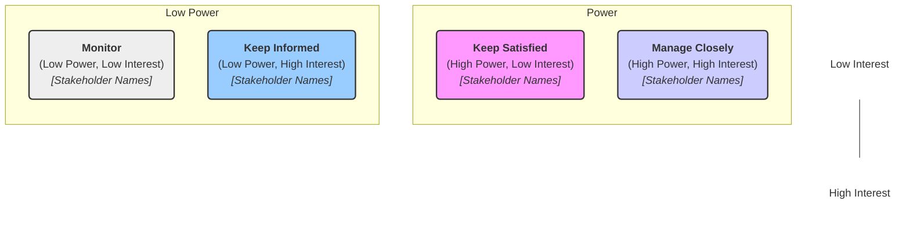

# Stakeholder Analysis: [Project Name]

* **Date:** [Date Created]
* **Project Lead:** [Name/Role]
* **Version:** 1.0

---

## 1. Stakeholder Identification & Analysis

_Identify all individuals or groups who have an interest in or may be impacted by the project. Analyze their involvement, impact, influence, and potential needs._

| Stakeholder Name/Group | Role (Relation to Project) | Involvement Level | Potential Impact (H/M/L) | Power/Influence (H/M/L) | Interest Level (H/M/L) | Key Needs / Expectations | Engagement Strategy |
| :--------------------- | :------------------------- | :---------------- | :----------------------- | :---------------------- | :--------------------- | :----------------------- | :------------------ |
| [e.g., Exec Sponsor]   | Project Sponsor            | High              | H                        | H                       | M                      | Budget adherence         | Weekly Updates      |
| [e.g., Engineering Team] | Core Team                | High              | M                        | M                       | H                      | Clear requirements       | Daily Standups      |
| [e.g., End Users]      | Customer                   | Medium            | H                        | L                       | H                      | Usable product           | UAT, Surveys         |
| [e.g., Legal Dept]     | Advisor                    | Low               | M                        | H                       | L                      | Compliance review        | Consult as needed   |
|                        |                            |                   |                          |                         |                        |                          |                     |

*(H = High, M = Medium, L = Low)*

---

## 2. Power/Interest Grid (Prioritization)**

_Map the identified stakeholders onto the Power/Interest grid to prioritize engagement efforts._

   > [!NOTE] Place stakeholder names in the appropriate quadrant based on the analysis in Section 1. Adjust node content as needed. This uses Mermaid syntax for visualization in GitHub.