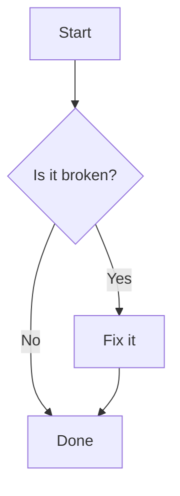

# Advanced Markdown Cheatsheet

This is a quick reference guide for the most useful Markdown syntax for creating professional and readable documents on GitHub. It is designed to be scannable, consistent, and easy to follow.

---

### **Text Formatting**

Use these basic styles to add emphasis to your text.

| Style         | Syntax        |
| :------------ | :------------ |
| Bold          | `**text**`    |
| Italic        | `*text*`      |
| Strikethrough | `~~text~~`    |
| Inline Code   | `` `code` ``  |

---

### **Headings**

Use hashtags to create headings. The number of hashtags determines the size.

| Syntax    | Output      |
| :-------- | :---------- |
| `# Text`  | # Heading 1 |
| `## Text` | ## Heading 2 |
| `### Text`| ### Heading 3 |

---

### **Lists & Task Lists**

| Type              | Syntax                  |
| :---------------- | :---------------------- |
| Unordered         | `* Item` or `- Item`    |
| Ordered           | `1. Item`               |
| Task (Complete)   | `- [x] Completed Task`  |
| Task (Incomplete) | `- [ ] Incomplete Task` |

---

### **Code Blocks**

Use triple backticks and specify the language for syntax highlighting.

````markdown
```sql
SELECT
    customer_id,
    order_date
FROM orders;
````

### **Tables**


| Header 1 (Left) | Header 2 (Center) | Header 3 (Right) |
| :-------------- | :---------------: | ---------------: |
| Cell 1          |      Cell 2       |           Cell 3 |

```markdown
| Header 1 (Left) | Header 2 (Center) | Header 3 (Right) |
| :-------------- | :---------------: | ---------------: |
| Cell 1          |      Cell 2       |           Cell 3 |
```


### **Links & Images**

```markdown
* Link: [Link Text](https://www.github.com)
* Image: 
```

---
### **Advanced Formatting**

---


#### **Alerts**

Use these special blockquotes to emphasize critical information.

| Type      | Syntax          | Output                                                  |
| :-------- | :-------------- | :------------------------------------------------------ |
| Note      | `> [!NOTE]`     | > [!NOTE] Useful information that users should know.      |
| Important | `> [!IMPORTANT]`| > [!IMPORTANT] Key information users need to know.        |
| Warning   | `> [!WARNING]`  | > [!WARNING] Urgent info that needs immediate attention. |


#### **Collapsible Sections**

This is extremely useful for hiding long sections of text.

```html
<details>
<summary><strong>Click to Expand Section Title</strong></summary>

This is the hidden content. You can put text, images, and even code blocks in here.

</details>
```


#### **Footnotes**

You can add footnotes[^1] to your content. They will be rendered at the bottom of the document.

[^1]: This is the text for the footnote.

```markdown
Here is a simple footnote[^1].

[^1]: My reference.
```

#### **Diagrams (Mermaid)**

You can create flowcharts and other diagrams directly in Markdown.

````markdown
